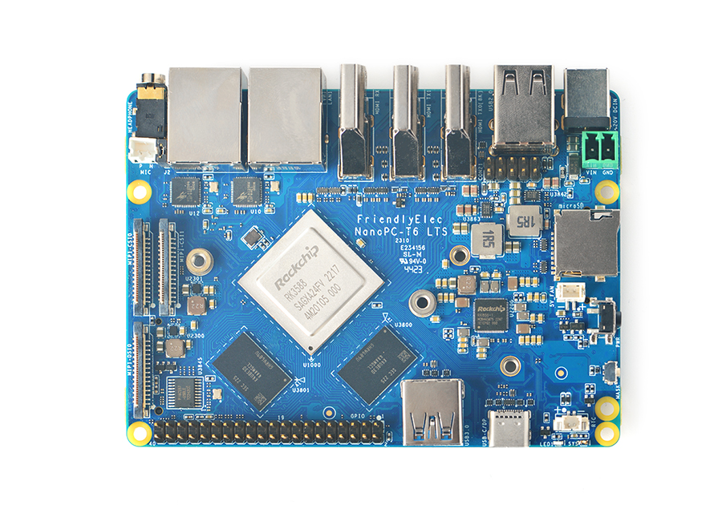

# Installation

## Pre-installed hardware
The Dogecoin Foundation offers pre-installed NanoPC-T6's 
running Dogebox which are available for purchase at [dogebox.dogecoin.org](https://dogebox.dogecoin.org).

## DIY
Dogebox is available as a bare-metal Linux install or as a 
virtual machine image for a number of platforms. Dogebox 
is also developed to run natively on the [FriendlyElec NanoPC-T6](https://www.friendlyelec.com/index.php?route=product/product&product_id=292) 
and a number of other ARM SBCs.

### DIY Installation options

- [Install directly on a FriendlyElec T6 ARM](./arm.md)
- [Install directly on any x86 computer as the host OS](./x86.md)
- [Install images for various Virtual Machines](./vms.md)
- [How to build the above images from source](./source_images.md)
