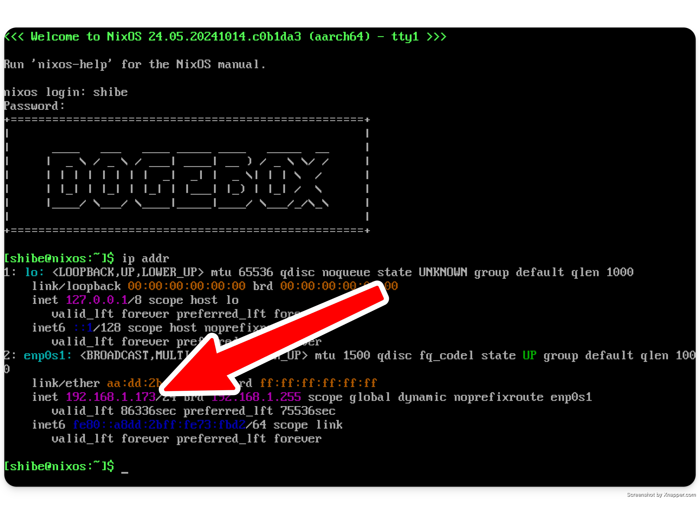

# Dogebox Initial Setup

On the first boot of your dogebox, the system will be available on https://dogebox.local:8080/.

In case your network blocks mDNS, which can happen in some cases use the following methods to determine the IP address of the machine.

## Determine your IP address

This won't be necessary in the near future, but for right now it is.

There's a couple of ways to do this:

#### Access to the machine

If you have access to the machine, you can login with the username `shibe`, and password `suchpass`.

Run the command `ip addr`, which should give you a list of IP addresses. Ignore the first lookback device `lo`, and look for an IP that starts with `10.`, `192.168.`, or `172.16.`.

#### No access to the machine

If you've started your machine without a display, or no keyboard, you'll need to determine the IP address using a different method. The easiest way to do this is to login to your router and look at the list of DHCP leases it has given out.

Unfortunately this is out-of-scope for this documentation, but a quick google of your router model and "list devices" should suffice.

## Visit setup UI

Once you've got your IP address or confirmed the box is available on dogebox.local, continue setup by visiting the Web UI. This is hosted on port `8080`.

eg. If your IP address is `192.168.0.2`, you should visit `http://192.168.0.2:8080` in your browser.

<a href="https://discord.gg/VEUMWpThg9">Stuck? Visit us on discord.</a>

See [Disk Installation](./setup/disk.md) to continue.
