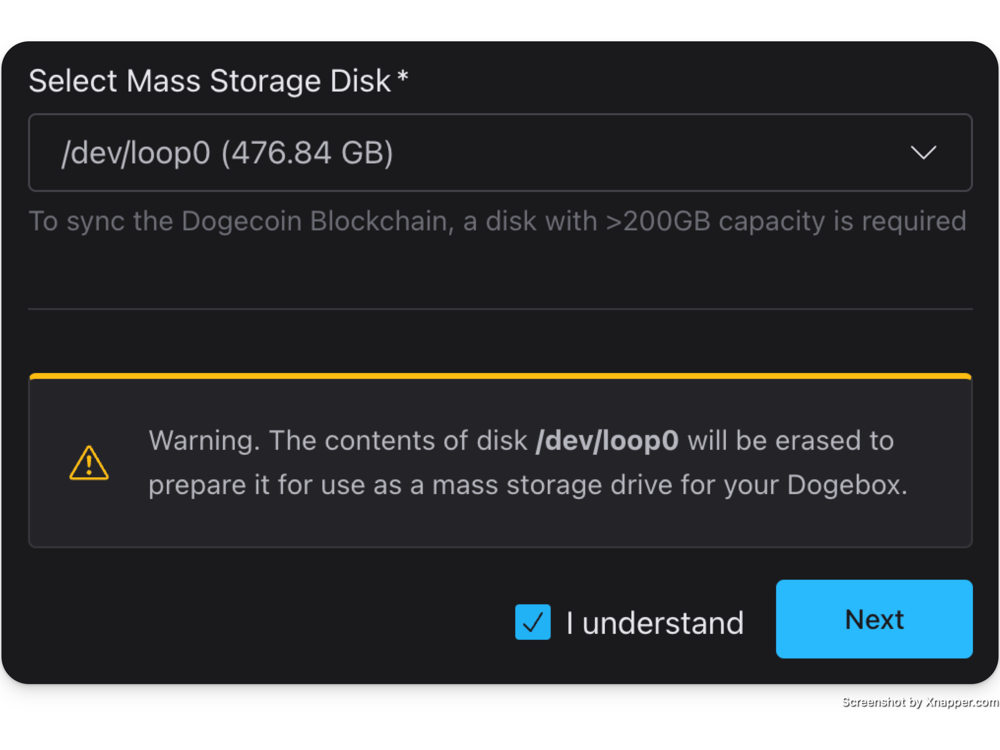
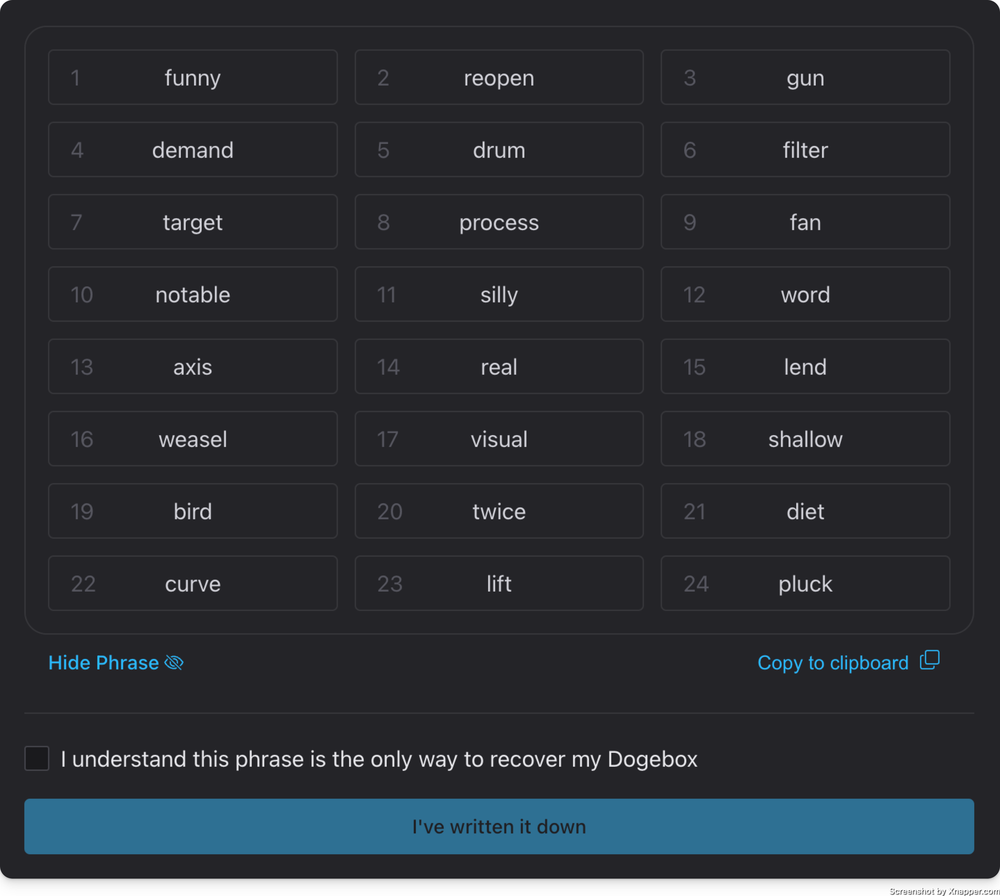
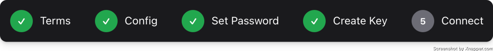

# Configuration

## Terms

This one is pretty simple. No options here, just you confirming you agree to some things.

## Config

Here we have some basic system configuration options.

#### Device Name

This is what your devices `hostname` will be set to. The value chosen here will determine the mDNS address you will be able to access the WebUI with later on. E.g. if you choose `my-dogebox` then you'll be able to access the WebUI at https://my-dogebox.local:8080/.

#### Keyboard Layout

If you are planning on using a keyboard (rather than `SSH`) to interact with your Dogebox, you should select your keyboard layout here so that when you press `a` it actually types `a` :)

#### Storage Device

Here is where you configure your storage device. By default it will select the disk that you have DogeboxOS installed to.

If you have an alternative (maybe larger?) disk that you wish to pick, select it here. This will be used for all pup storage and other Dogebox configuration things. This will require you to confirm that everything on this disk **will be destroyed**.

## Set Password

This is where you will set your access & encryption password. Currently, we do not restrict what your password can be, so ensure that it is secure, because it will be protecting your whole Dogebox!

## Create Key

Clicking `Generate` will create a new HD private key that will be the root of everything for your Dogebox.

Once done, it will pop up the seed phrase for this key.

As mentioned, this will be the only time <b>ever</b> you will get access to this seed phrase. You must back it up somewhere securely, or risk losing access to your Dogebox.

## Network

Currently we only support Ethernet connections. Support for Wi-Fi is coming soon™ in a release.

Here you can select how you want your Dogebox to connect to your network.

You can also enter an SSH **public** key here, if you have one. This will enable the SSH server on your Dogebox as an alternative method to access.

Hitting `Connect` here will start configuring your box, and might take a little while!

## Done!

If you got here, you're all set! Your dogebox should automatically reboot, connect to your specified network, and then start up in normal mode (instead of recovery/setup mode).

After a little while (a minute or two) you should see the `Launch Dogebox` button enable itself, showing the detected Dogebox IP address next to it.

Doesn't happen? No worry, on some networks it might not be supported. Try refeshing the page after a little bit and see if you can re-connect, otherwise follow the instructions for "Finding your IP address" again.

You're all done. Install some pups. Run a core node. Sell some stuff. Join the network.

The options are unlimited.
