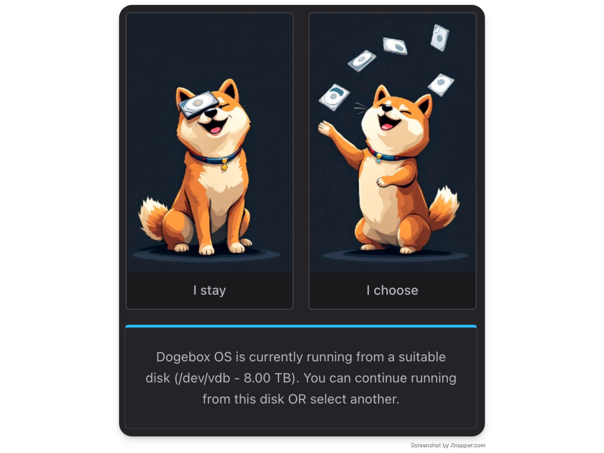
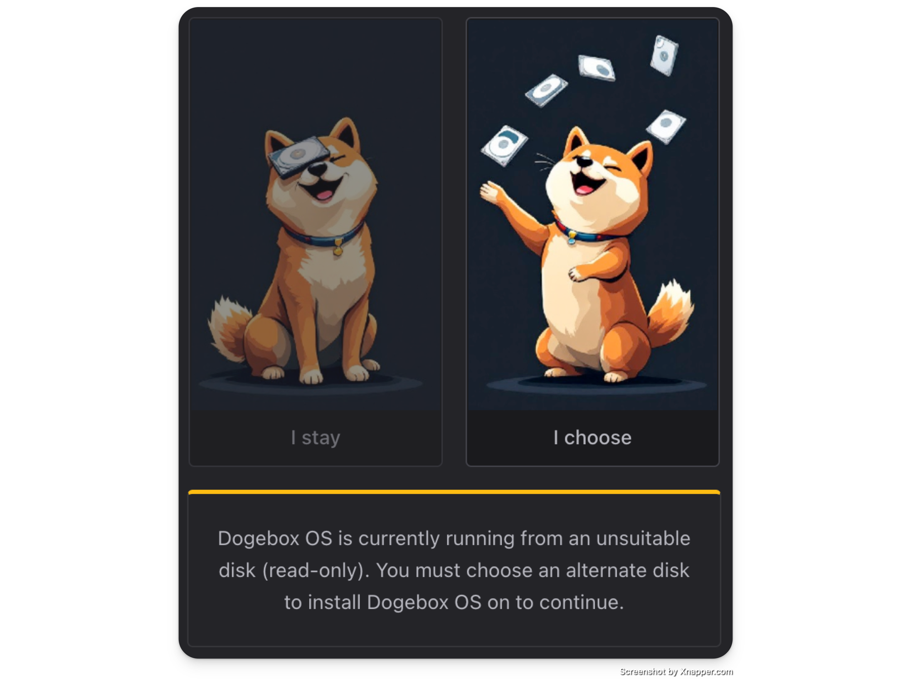
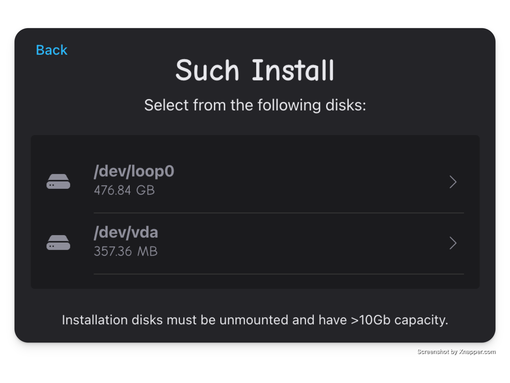
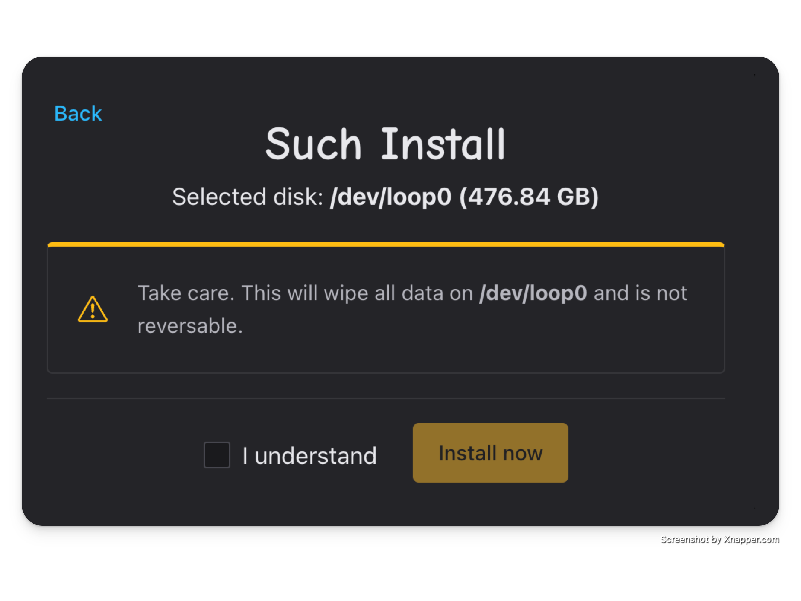
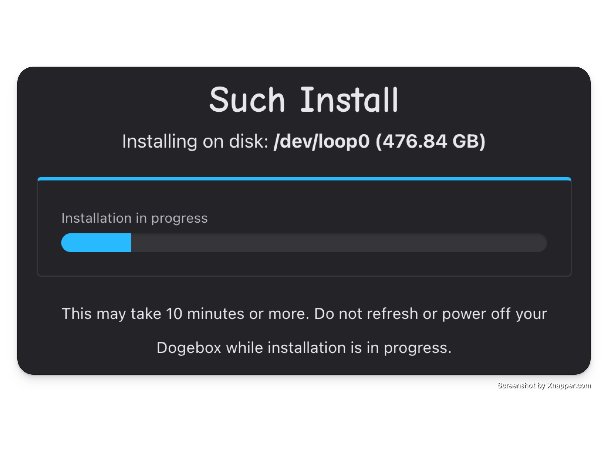
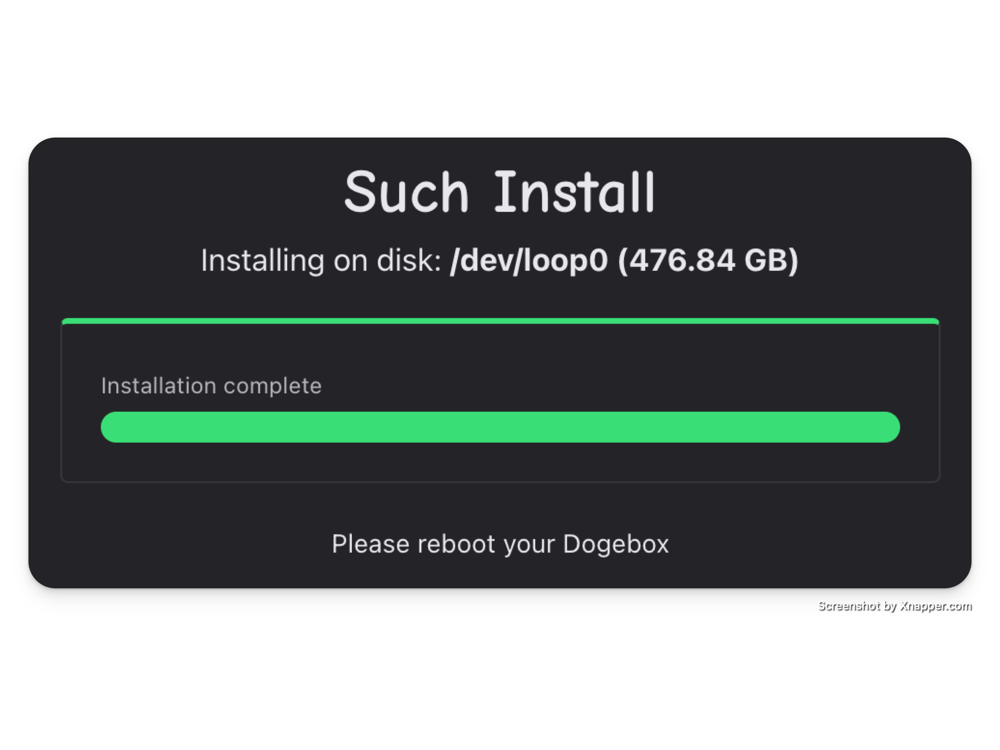

# Disk Installation

The first time you boot your dogebox, you'll be presented with one of the following prompts:

 
 

   If you see this, you're able to continue booting from the current media. If you're satisfied with what DogeboxOS is installed on, you can hit "Stay" and continue following the <a href="configuration.html">setup instructions here.</a>

 
 
 
 

   
If you see this one, you <b>must</b> install DogeboxOS onto a separate device, as your current boot media isn't compatible with some reason (maybe it's marked as read-only?)

Keep following below.

 
 

## Select your Disk

Now is the point where you should select the disk you want to install to.

Currently there are some restrictions on which drives show up:

- They must be unmounted, and contain no existing partition table.

<a href="https://discord.gg/VEUMWpThg9">Expecting a disk that isn't visible? Visit us on discord.</a>

## Confirm wipe

Once you've selected your disk, you need to confirm that <b>all data on the selected disk will be destroyed</b>

## Installation

Sit back and wait for installation to complete, this may take up to 10 minutes.

## Reboot

Once you're done, you need to power off your Dogebox and restart it to exit setup/recovery mode.

When rebooted, see [Setup Configuration](./configuration.md) for next steps.

