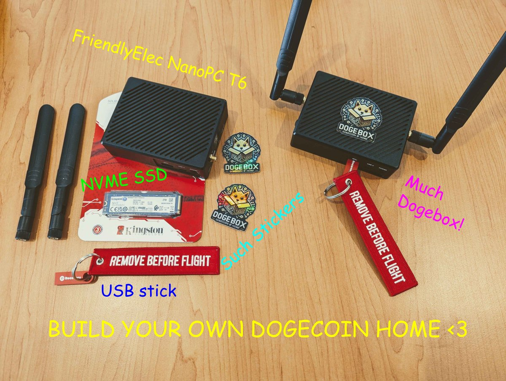
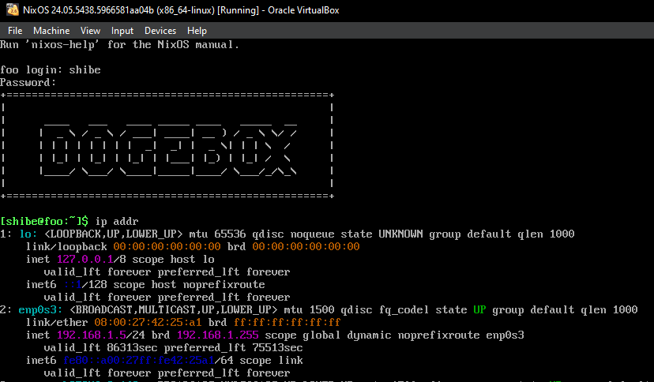

# FriendlyElec NanoPC-T6

Beta release of the Dogebox OS built specifically for the FriendlyElec NanoPC-T6.

## Things to note / What does not work

These things will all be fixed in a following release. This release is for tinkerers that are happy to re-flash a couple of times before a stable T6 release.

- The T6 bootloader only supports booting from microSD cards that are 32GB and smaller (SDHC, not SDXC)
- Ethernet is required to be plugged in at first initial boot.
- The OS still has a hardcoded username and password: `shibe` and `suchpass`. Please do not deploy your box on any unsecured network, as anyone may be able to login to your T6. This will be rectified in the next release with proper SSH key management.
- WiFi configuration during initial setup is currently not supported.

## Download images

Head over to [https://github.com/dogeorg/dogebox/releases](https://github.com/dogeorg/dogebox/releases) and download
the latest **dogebox-v0.x.x-beta-T6.img.gz** file.

## Decompress the downloaded file

The Image file is compressed with gzip to save on bandwidth. This compressed file, however, must be decompressed to be flashed to the microSD card in order to be able to boot from it, when plugged into the dogebox hardware.

## How to get the image to the microSD card

The file you've downloaded is an filesystem image file. This means you have to copy the data over to the microSD card in a specific manner to make sure the data is able to be read when the machine boots.

To do this we recommend using a image flashing tool such as [Balena Etcher](https://etcher.balena.io/) or [Rufus](https://rufus.ie/en/)

## How to flash microSD using `Balena Etcher`

- Open `Balena Etcher`
- Click `Select iamge` and navigate to the location of your downloaded and decompressed `.img`
- Click `Select Drive` and choose the microSD card
- Click `Flash` and wait for the flashing process to finish

## How to flash microSD using `Rufus`

You can easly flash using the OpenSource Rufus Tool that you can get the latest version here for your operating system: [https://github.com/pbatard/rufus/releases](https://github.com/pbatard/rufus/releases)

- Open `Rufus`
- On `Device` select your microSD card
- Click on `Select` and Choose the file you downloaded and decompressed `.img`
- Click on `Start` and wait a few minutes to finish

## How to flash microSD using `dd if=`

- Download the T6 `.img.gz` file attached to the release.
- Uncompress the image so you get the raw `.img` file. On windows you may need to download 7-Zip to uncompress the image.
- On Linux & MacOS, use `dd if=` to write the file to the raw microSD device.
- On Windows, use a raw image disk writer UI. There are multiple available, e.g. Rufus.

## How to Setup

With a monitor and keyboard available

- Insert the microSD card with image flashed.
- Ensure you have an ethernet cable plugged into your T6 box.
- Plug in a HDMI screen, make sure it's plugged into `HDMI1`.
- Plug in a keyboard.
- Plug power in.
- Wait until the box finishes booting, this could take anywhere from 2 to 10 minutes.
- Once finished, login with the username `shibe` and the password `suchpass`.
- Enter command `ip addr` and take note of your IP address.
  - Ignore the `lo: <LOOPBACK>` section, look for another one.
  - Look for a line that starts with `inet` followed by your IP address, in this example `192.168.1.5`.
  - See the screenshot below.
- In a web browser, visit `http://your_ip_address:8080` to start configuring your dogebox.
  - In this example, it would be `http://192.168.1.5:8080` but your IP address will be different.
  - This will load the DogeBox Setup page.

Without a monitor and keyboard available

- Insert the microSD card with image flashed.
- Ensure you have an ethernet cable plugged into your T6 box.
- Plug power in.
- Wait until the box finishes booting, this could take anywhere from 2 to 10 minutes.
- In a web browser, visit `https://dogebox.local:8080` to start configuring your dogebox.
  - This will load the DogeBox Setup page.

## Restart your Dogebox

If you choose to install DogeBox OS on the internal eMMC storage (recommended), the setup page will ask you to restart your DogeBox.

- Go back to the hardware T6 keyboard, and enter command `sudo shutdown -h now` to shut down cleanly.
- This also works if you want to shut down your DogeBox at any time (you may have to log in first)
- It's a good idea to do this every time you want to shut down the DogeBox, otherwise pulling the plug risks corrupting the eMMC storage or SD card, and you might have to wipe your DogeBox and start over (often it will recover, but not always)

## Shut Down your Dogebox

Descibed above under _Restart your Dogebox_
