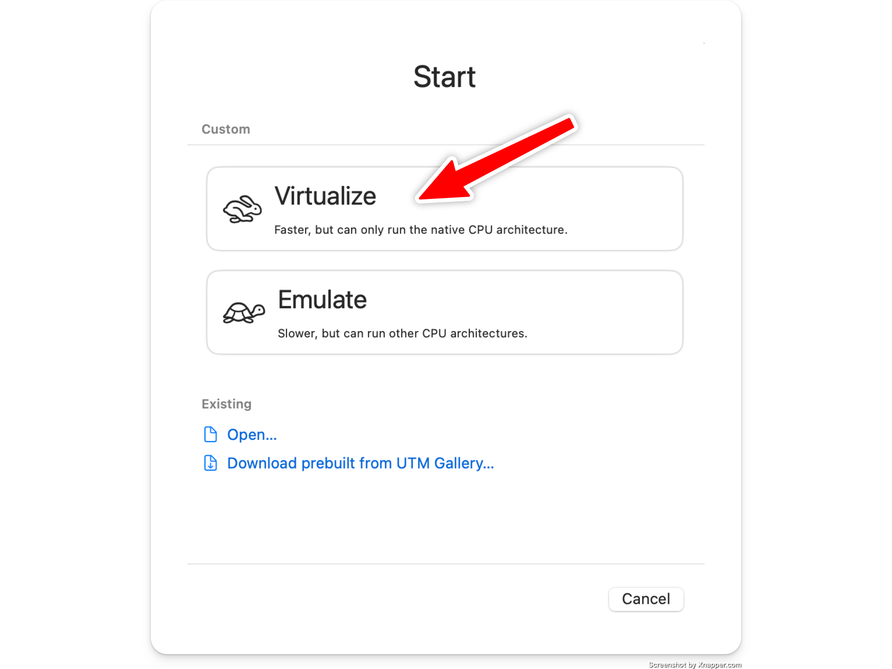
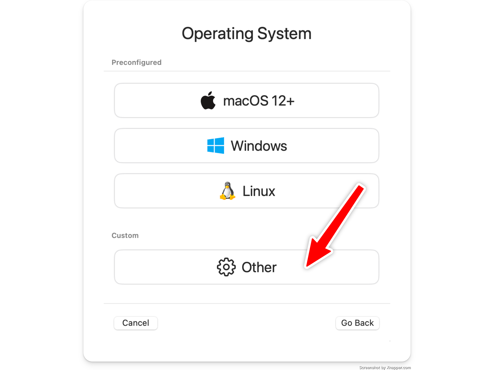
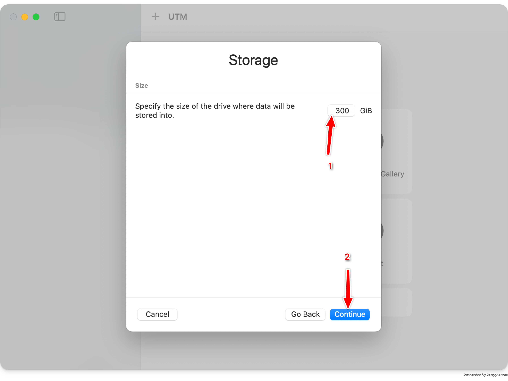
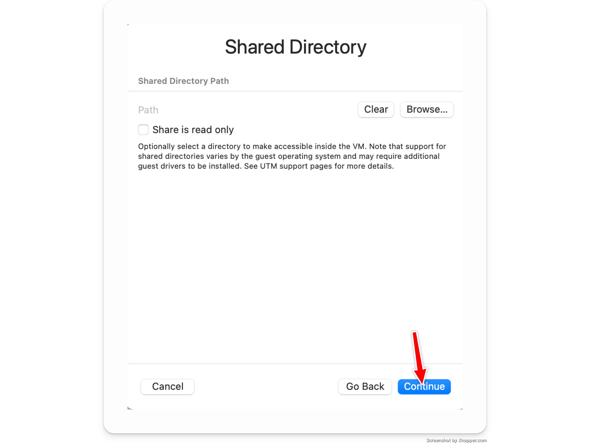
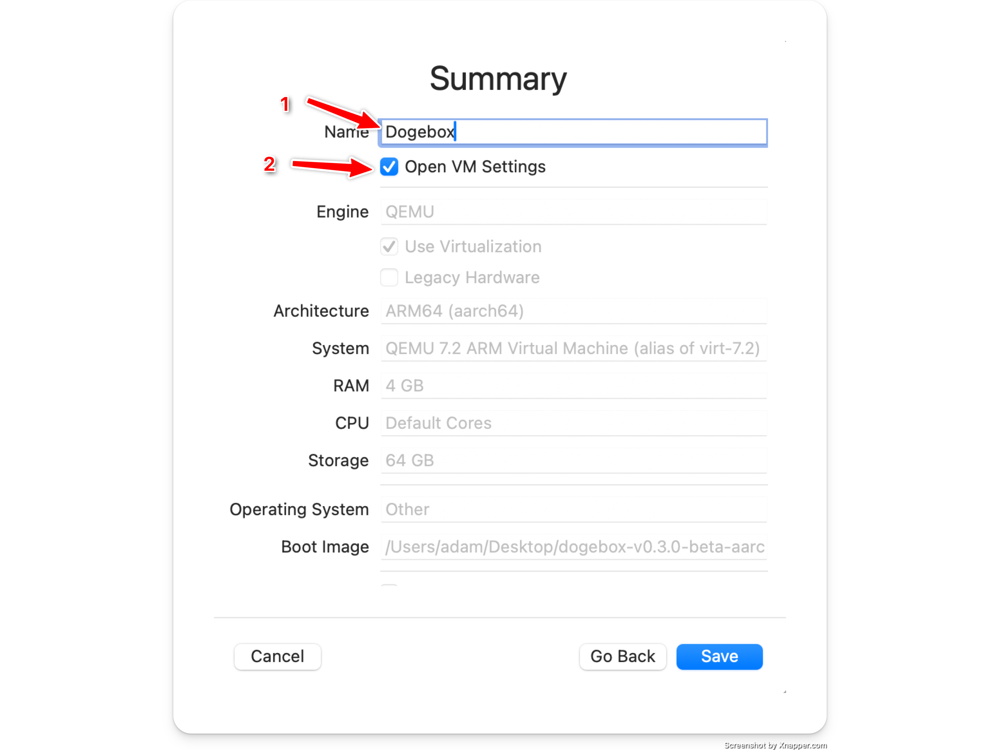
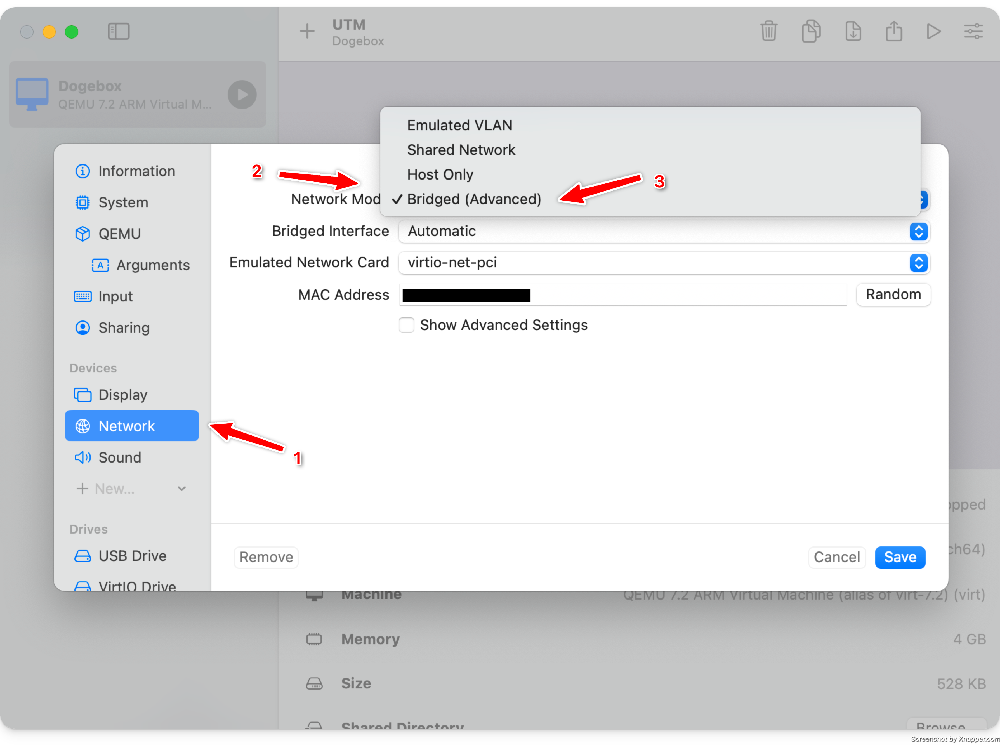

# UTM

UTM can only be used on Apple Silicon Macs (M1, M2, M3 models). If you have a different machine, please see the compatibility table in <a href="../vms.md">Virtual Machines</a>

## Downloading

Visit the [Dogebox releases page](https://github.com/dogeorg/dogebox/releases), and downloaded the latest asset ISO image for the `aarch64` architecture.

## Installing

#### Create new Machine

#### Select Virtualise

#### Select "Other" operating system

#### Select the downloaded aarch64 ISO file

#### Set the amount of ram you want

The default of `4096mb` is typically fine.

#### Set the amount of storage you want

UTM uses sparse disk files, so a 500GB disk will not actually take up 500GB on your hard drive.

If you wish to sync the blockchain in this VM image, ensure you set this to over `300GB`.

#### Skip any shared directory configuration

#### Name your VM image and open settings

### Configure Bridged networking

- Select `Network` on the lefthand side.
- Change `Network Mode` to `Bridged (Advanced)`

### Save & Launch

## Setup

Please see [Initial Setup](../setup.md)
