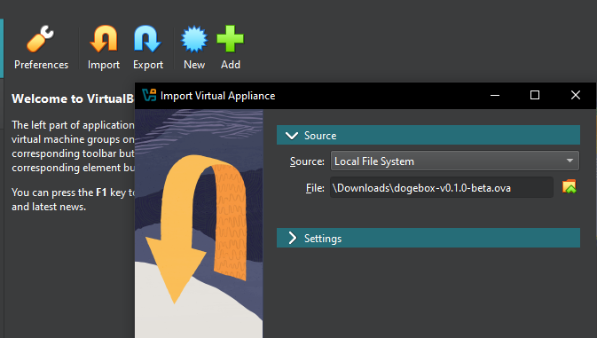

# Virtualbox

1. Download [Virtualbox](https://virtualbox.org), or another OVA compatible VM launcher.

2. Import the OVA image by selecting the file you downloaded from the latest release.

3. Ensure the VM has sufficient RAM for the software you plan to run on the Dogebox.

4. Once imported, click 'Settings' and configure your Virtual Machine's network to use 'bridged mode'. This is required so you can visit the Dogebox DPanel in your web browser.

5. Launch the VM. This may take up to 10 minutes depending on your internet connection, to configure itself initially, grab a cuppa.

6. Login with username: `shibe` and password: `suchpass`, then run `ip addr`, it may look different to this but skip the first loopback interface 'lo' and look for another interface, then look for the line `inet` with your IP address, in this example: `192.168.1.5`

7. In a web browser, visit **http://your_ip_address:8080** to visit the setup experience and configure your dogebox. In this example it would be `http://192.168.1.5:8080` but your IP address will be different.
