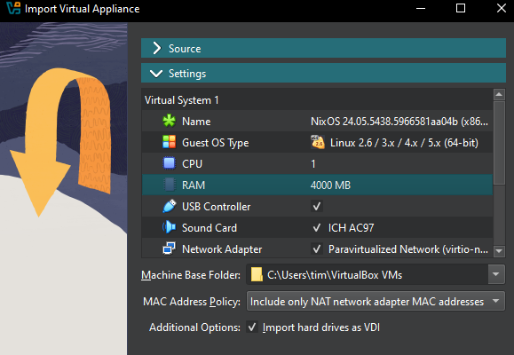
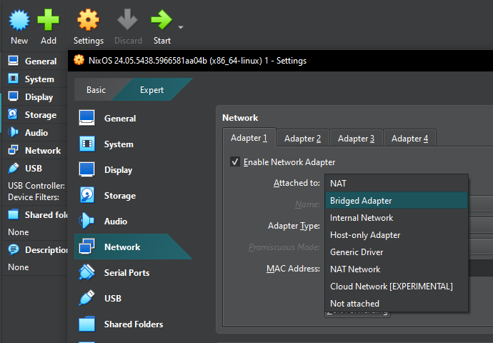
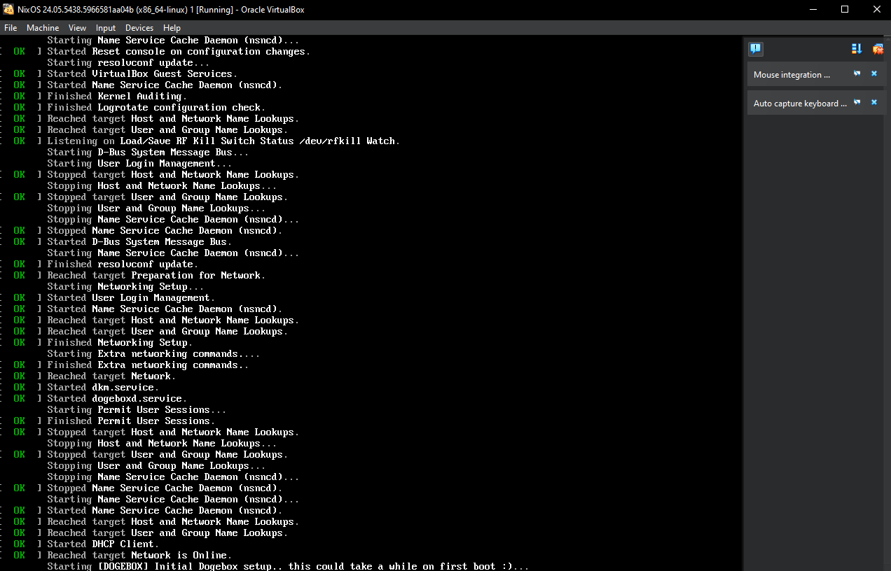

# Virtual Machines

## Download images
Head over to [https://github.com/dogeorg/dogebox/releases](https://github.com/dogeorg/dogebox/releases) and download 
the appropriate image for your VM platform.

## Steps to run on VirtualBox
1. Download [Virtualbox](https://virtualbox.org), or another OVA compatible VM launcher.

2. Import the OVA image by selecting the file you downloaded from the latest release.

3. Ensure the VM has sufficient RAM for the software you plan to run on the Dogebox.

4. Once imported, click 'Settings' and configure your network to use 'bridged mode'.

5. Launch the VM. This may take up to 10 minutes depending on your internet connection, to configure itself initially, grab a cuppa.

6. Login with username: `shibe` and password: `suchpass`, then run `ip addr`, it may look different to this but skip the first loopback interface 'lo' and look for the highlighted IP, in this example: `192.168.1.5`

7. Open your browser and visit http://&lt;ip&gt;:8080 to visit the setup experience and configure your dogebox.

