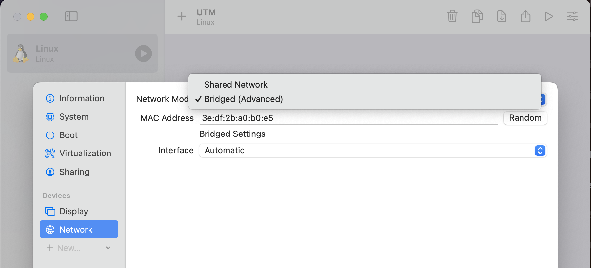

# Virtual Machines

## Download images
Head over to [https://github.com/dogeorg/dogebox/releases](https://github.com/dogeorg/dogebox/releases) and download 
the appropriate image for your VM platform.

## Steps to run on VirtualBox
1. Download [Virtualbox](https://virtualbox.org), or another OVA compatible VM launcher.

2. Import the OVA image by selecting the file you downloaded from the latest release.

3. Ensure the VM has sufficient RAM for the software you plan to run on the Dogebox.

4. Once imported, click 'Settings' and configure your Virtual Machine's network to use 'bridged mode'. This is required so you can visit the Dogebox DPanel in your web browser.

5. Launch the VM. This may take up to 10 minutes depending on your internet connection, to configure itself initially, grab a cuppa.

6. Login with username: `shibe` and password: `suchpass`, then run `ip addr`, it may look different to this but skip the first loopback interface 'lo' and look for another interface, then look for the line `inet` with your IP address, in this example: `192.168.1.5`

7. In a web browser, visit **http://your_ip_address:8080** to visit the setup experience and configure your dogebox. In this example it would be `http://192.168.1.5:8080` but your IP address will be different.

## Other Virtual Machines

Any virtual machine that supports x86_64 OVA or ISO images should work.

Please consider the following:
- Network Bridged Mode is required, so you can visit the Dogebox DPanel in your web browser. When you create your new virtual machine, configure this in the settings (or command-line options). See screenshots above for an example.
- Your virtual machine must support a display, so you can log in and find out its IP address. Again, see screenshots above for an example.

### QEMU

Instructions for QEMU can be found at the bottom of [this page](https://github.com/dogeorg/dogebox).

### Mac OS - Apple silicon

On Apple silicon (M1 etc) you can use [UTM](https://mac.getutm.app/) with the latest dogebox `aarch64.ISO` image from the [releases page](https://github.com/dogeorg/dogebox/releases).

#### Installing

- In UTM, click the big `+` and choose `Virtualize` option.
- Select `Other` Operating System at the bottom.
- Browse.. and select the dogebox `aarch64.ISO` image you downloaded, click `Continue`
- Increase Memory to `8192 MB` or higher.
- Set at least `2` CPU Cores.
- Storage: set the size to `300 GB` or greater.
- Continue past the `Shared Directory` options.
- Change the name to `DogeBox` (or similar),
- Tick the box `Open VM Settings` and click `Save`.
- In the left column of the Settings page, click on `Network`.
- Change the `Network Mode` to `Bridged (Advanced)` and click `Save`.

#### First run

Click the Play button to start your Virtual Machine. Follow steps 5 though 7 described above for VirtualBox:

5. Start your VM and wait for it to boot,
6. Login and find out your IP address,
7. In a web browser, visit the DogeBox Setup page, as described above.

#### Restart your Dogebox

When the DogeBox Setup page asks you to Restart your Dogebox:

- Go back to the Virtual Machine login window and enter command `sudo shutdown -h now` to shut down cleanly.
- Wait for the window to clear - it becomes a big play button
- Switch back to the main UTM window
- At the bottom of the Virtual Machine's info page, find the CD/DVD drop-down (you might need to scroll down)
- Click on it and choose `Clear` so it becomes `(empty)` - this removes the installer image.
- Then, click the Play button to launch the VM again.

#### Shut Down your Dogebox

If you want to stop your DogeBox Virtual Machine:

- Go back to the Virtual Machine login window.
- Log in if necessary with username: `shibe` and password: `suchpass`
- Enter command `sudo shutdown -h now` to shut down cleanly.

It's a good idea to do this every time you want to shut down the DogeBox, otherwise stopping it with the Stop button risks corrupting the virtual disk image, and you would have to delete the virtual machine and start over.
