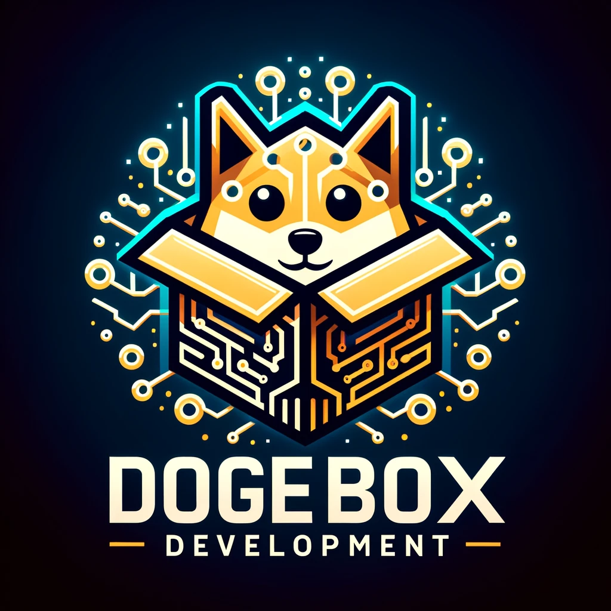

## What is the Dogebox project?

Dogebox is a Linux server distribution and custom server software built
specifically to meet the needs of the Dogecoin community.

The objective: to provide a decentralised platform for the development, 
distribution and self-hosting of software (we call them PUPs) that will 
bring real utility to the Dogecoin ecosystem and drive adoption.

## What's in the box? 

Dogebox is a locked down custom configuration of NixOS Linux which includes
a number of Dogecoin specific services that combined deliver the Dogebox 
UI, the DRE (Doge Runtime Environment), Pup management and secure interaction
between Pups. 

### Dogeboxd - Pup management and runtime orchestration
[https://github.com/dogeorg/dogeboxd](https://github.com/dogeorg/dogeboxd)

Dogebox runs a daemon process 'dogeboxd' which provides installation 
and orchestration of Pups which are run in isolated containers via 
Linux Systemd / Linux Namespaces. 

Dogeboxd manages inter-pup communications via nix-config rules, exposing
TCP ports between containers, and proxying REST APIs as required for Pups 
to communicate with their dependencies, in accordance with their manifest rules.

This is all done in aid of providing an easy to use platform for Dogecoin
users that can provide a secure runtime environment for Dogecoin adventurers
who are not Linux administrators. 

### DPanel - Admin UI
[https://github.com/dogeorg/dpanel](https://github.com/dogeorg/dpanel)

The Dogebox is managed via a convenient Web control panel that allows the
user to install new Pups from the community, determine how they can communicate 
with eachother and the network, and then ensure they are running and monitored.
### DKM - Doge Key Manager

[https://github.com/dogeorg/dkm](https://github.com/dogeorg/dkm)

The DKM provides cryptographic authentication to the Dogebox and Dogecoin key 
management for Pups in a manner that lets the user recover and control any 
keys generated by pups, via the use of hierarchical deterministic keys.

Each Pup installed is issued a 'delegated' child key from the Dogebox user's 
master key. Pups can then use these keys to derive further child keys for use 
as pay-to addresses or anything else such as providing full wallet functionality,
online shops, etc.

DKM creates an encrypted master key and generates (derives) private-public 
keypairs for pups and other parts of the DogeBox ecosystem.

Keys are encrypted at rest with the DogeBox password and stored on disk.

Passwords are first hashed using Argon2 memory-hard KDF (Argon2id variant) 
with parameters time=3, memory=64M, threads=4 and the BLAKE2b hash function 
as recommended in RFC 9106.

The password-derived hash is then used to encrypt the master key with ChaCha20 
cypher and Poly1305 Authenticated Encryption (AE) scheme.

Keys in DKM are only in memory while they are actively being used for Authentication 
or key derivation.

### Dogenet - Multi-protocol gossip network

[https://github.com/dogeorg/dogenet](https://github.com/dogeorg/dogenet)

DogeNet is a service that implements the _Doge Gossip Protocol_, which is a 
multi-channel protocol for communicating among Dogenet nodes. 

It is a foundational piece for future experimental protocols (ComPoS / Sakura), 
and provides useful side-channels for Dogecoin adjacent projects to communicate 
without polluting the Dogecoin blockchain, where simple peer-to-peer 
communication is sufficient.

DogeNet builds a database of active DogeBox nodes, which is used to find peer 
nodes to connect to. DogeNet maintains a connection to at least 6 peers at all 
times (more if running novel protocol-handlers that require connecting to other 
participating nodes.)

DogeNet exposes a local UNIX-domain socket for custom Protocol Handlers to connect to 
DogeNet and send/receive messages on any channels they're interested in.

Channels are assigned to different protocols; for example, DogeNet nodes announce 
their presence and public address on the ''Node' channel; DogeBoxes can optionally
announce an identity profile on the ''Iden' channel, for display on the DogeMap and 
for use in future social pups.

